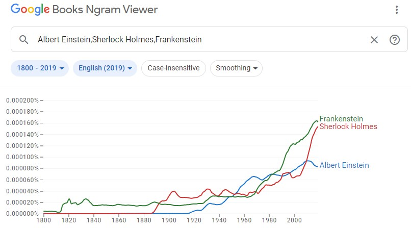

## What are N-Grams

N-Grams are a contiguous sequence of n items derived from a given string. For every token in a string, a tuple is created containing that token and the next n-1 tokens. 

For example given the string:
`"The quick brown fox jumped over the lazy dog"`

A 1-gram (unigram) would look like the following:
`(The), (quick), (brown), (fox), (jumped), (over), ...`

A 2-gram (bigram) would look like the following:
`(The quick), (quick brown), (brown fox), (fox jumped), ...`

The "N" in N-Gram is simply the number of words contained within a tuple. Further N-Grams may be considered such as trigrams, 4-grams, 5-grams, etc...

## How are N-Grams used to build a model

N-Grams are used to build a probabilistic model which can attempt to predict what item will come next within a sequence. Models can be built using example sentences for a given language. The examples are tokenized by words and made into a list of N-Grams. You can then take that list and sum the number of times each tuple appears. Based on that, a probability can be calculated for the likelihood of a certain word coming next in a given sequence.

## Applications of N-Grams

N-Grams have many different applications. They are used in this program to determine the most likely language of a given sentence. They can also be used for things like text generation. Text can easily be generated by using the likelihood of the next word (or set of words) in a sequence. Though, these sentences may not be cohesive and lack an overall direction; they are simply replicating the patterns seen in the training data. N-Grams can also be used in a which broader capacity in applications such as biology or data compression. 

## How probabilities are calculated

The probability for a given N-Gram is calculated by multiplying the probability of the first word by the probability of the following words given the prior word is there before it. 

`P(w1, w2) = P(w1)*P(w2|w1)`

`P(w1, w2, ..., wn) = P(w1)*P(w2|w1)*...P(wn|w1,w2,...,wn-1)`

Performing the above calculation every time is complex and expensive, however, some simplifications can be made to provide a less costly estimate. You can make a Markov assumption and assume that you only have to look at the previous word in a sequence rather than the entire sequence.

`P(w1, w2, ..., wn) = P(w1)*P(w2|w1)*...P(wn|wn-1)`

## Importance of source text

Having good source text is vital to creating an accurate model. The source text is directly used to generate a statistical model of the given language. As such, if there are any discrepancies between the source text and the intended language then those discrepancies will be improperly used as the evaluation criteria. It is important that the source text is accurate so that it can be a fitting evaluation criteria for generating accurate statistics. 

## Importance of smoothing

Smoothing is important in N-Gram models because the model may not cover every scenario for a given set of words (sparsity). There will inevitably be some set of words that were not in the source text, yet, a probability should still be generated for it. If a probability of 0 is used then the calculations involving the unknown words will always result in 0. Smoothing remedies this by filling in values with 0 probability with a very small probability. 

There are multiple different ways to apply smoothing to an N-Gram model. In my case, I used a technique known as LaPlace smoothing described below:

```
P(w1) = (C(w1) + 1) / (N + V)

C: Count of N-Gram in training data
N: Number of tokens in training data
V: Vocabulary size of training data
```


As you can see, the + 1 in the numerator ensures that the result will be non-zero. The V in the denominator ensures that the resulting probability will be relatively small compared to the overall vocabulary size. 

## Usage in text generation

Text can easily be generated using N-grams and their probabilities. Given a starting word, the probability of the following N-grams can be used to get the next likely word and this process can be repeated multiple times to generate a full sentence. Lower level N-Grams (unigrams/bigrams) will not work as well as higher levels N-Grams (trigrams, etc) because less about the word associations is known. A more extensive corpus of text also assists in getting better results because more info is derived from the language. 

#### Using NLTK to generate text

NLTK comes with the capability of generating text based on a given corpus. In order to use it, you must generate unigrams from the training data and use them to create an NLTK text object. The generate() method on the text object may then be used to generate text based on the input text. As stated before, the more extensive the input data is, the better the results will be. 

## Evaluating language models

There are many different ways to evaluate the accuracy of a language model. Measurements such as entropy, cross entropy, perplexity, bits-per-character, and bits-per-word are some examples of evaluation methods used today. Each has their own respective positives and negatives, therefore, multiple metrics may be used at once to develop and overall evaluation. 

In the case of this assignment, a more simplistic/primitive approach was used. The goal of this language model was to be able to determine the language of a given piece of text. Because the language of the text is known, it can be used as the evaluation criteria for the model. The model simply generates a probability for each language and returns the most likely result. This result can then be directly compared to the actual known answer and determine if it was accurate or not. 

`% Accuracy = # Correct Predictions / Size of Testing Set * 100`

## Google N-Gram Viewer

The Google N-Gram viewer utilizes the entire Google Books corpus to plot the occurrences of that phrase over a period of time. Multiple phrases can be searched at once and be compared with one another. 

Below is an example of using the viewer to compare the frequency of 'Frankenstein', 'Sherlock Holmes', and 'Albert Einstein' over time:



---

###### References
> [1] Wikipedia Contributors, “n-gram,” Wikipedia, Aug. 28, 2022. https://en.wikipedia.org/wiki/N-gram (accessed Oct. 02, 2022).

> [2] K. Mazidi, Exploring NLP with Python: Building Understanding Through Code. 2019.